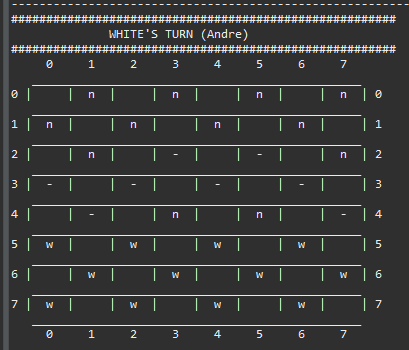
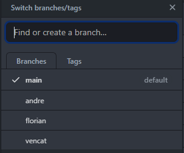

# Java-Project 

# Jeu de Dame / Checkers

## How to start the game and Things used

* In *Eclipse* File -> Import -> Git -> Projects from Git (with smart import) -> Clone URL -> put the URL and authentification -> Next

* For start the Checkers right click on the new file *JeuDeDame* created in the Package Explorer and click on *Run As*

* For this Project we used, Github for the git, Eclipse as IDE, And Discord for the communication between the members

* /!\ Warning, If you need to double *Enter* after an Input it's because of Eclipse bug /!\ 

------------------------

# Description 

Our project is a Checkers in a terminal, where you can fight in a One on One with somebody else.

You play One by One, your goal is to Eat all the enemy pawns, or block them so that they can no longer play

Be careful there are rules to respect you need to eat when you can eat, and you can eat more than one pawn

And if a pawn go to the other side of the board, he became a *KING/QUEEN*

If you want to test configuration of board you can go in utils/CreatePerso.java and remove the comment of pawn

/!\ Always take p1 to p24 and comment all the one you don't use. I suggest to test the Test 5 and 6 /!\

You can enter the White *Nickname*, the Black *Nickname*. The winner of the game will have the honor to get his Nickname written in the *nicknameList.txt*

And he'll see his number of win in *countNicknameVictory.txt*

You game is print in a logs.txt, so you can see your move in the present time (but as soon that you restart a game the file is deleted)

And their is also many text to help you during the game !

So Have Fun and Good Luck !

------------------------
                                             
With this project, we learn how to code a checkers with Java in a terminal

------------------------

## Authors

Code writted by **CLAVERIA Andre**, **MALLIPOUDY Vencat**, **MORACCHINI Florian**

------------------------

## Work of the members and Methodology

We decide to work together in our free time, with *DISCORD*, we make a big part of the project together, except for exemple the textual, the TXT, the README...

* All the projet was on Github, we worked on different branch for not making merging problem. 

* Firstly, we decided witch project we would done, we choosed Checkers because for us it was the one who could learn us the most things, and because we found this project more attractive than the other

* After that we started to create the board, and place pawns on it

* Next we started with the move of the White pawns, and Black pawns

* To continue we made the taking the pawns

* And After, The Queen/King

* With all of this we made the Textual, the Txt file, the Winning condition..

* For the bot we didn't got the time to make it, but at the beginning if you decide to fight him, you will get a "In development"

* That's all for the project, thanks to have read this, Have fun with the gameplay and Good luck vs your opponent !

------------------------

## END, thanks

## Cordially,

## The Team !

------------------------